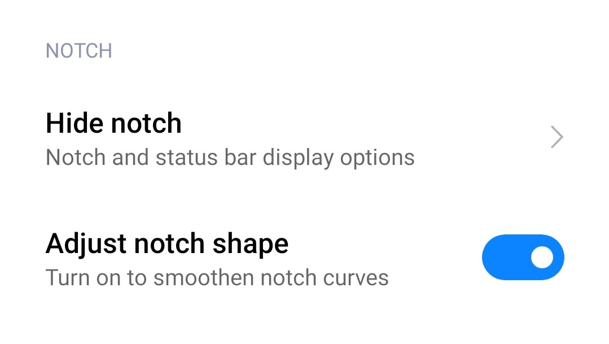
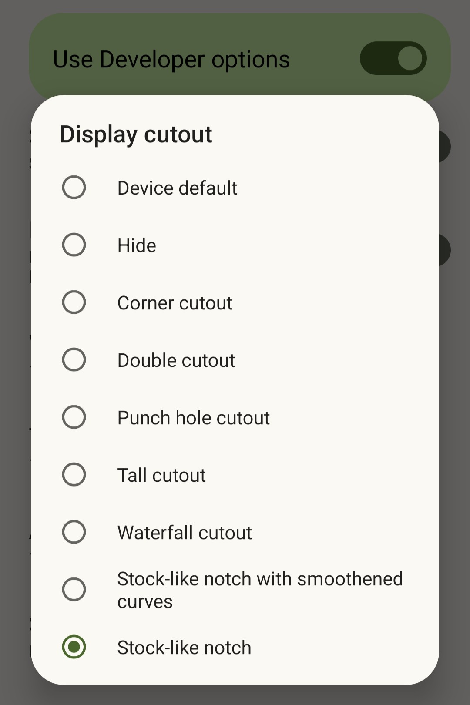

# Grus Display Cutout Emulation Overlay

A stock-like overlay for Xiaomi Mi 9 SE.

It tries to mimic stock notch.

## Two flavors of stock

As the stock rom (e.g. `12.5.1.0 RFBMIXM` / Android 11) says, the notch shape can be adjusted: "Turn on to smoothen notch curves".

## Two flavors of Grus Display Cutout Emulation Overlay

This repo contains modules for both shape.

# Thanks

Thanks goes to **Kr328** for creating [Kr328/MarsCutoutOverlay](https://github.com/Kr328/MarsCutoutOverlay)! 
